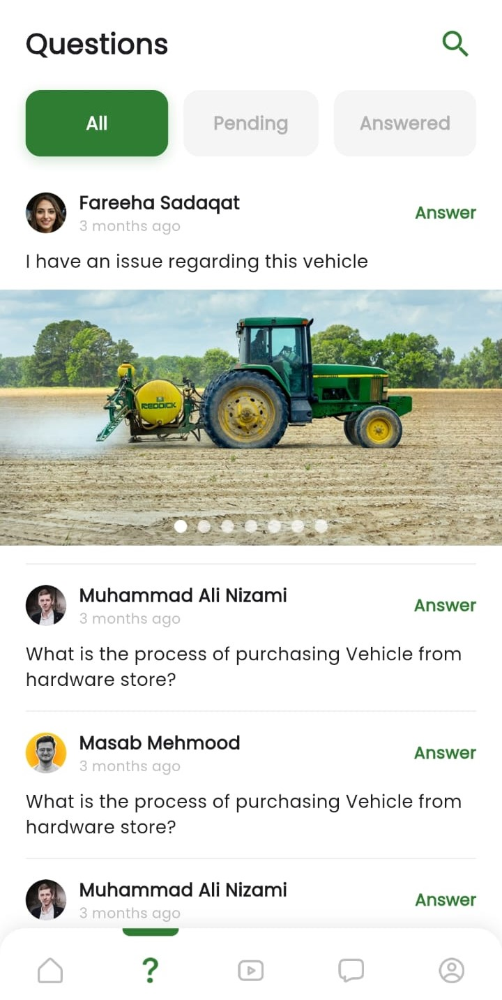

# Agri-Expert — Flutter Agricultural Advisory App

A mobile advisory app built for agricultural 
users. Crop guidance, expert recommendations, 
and agricultural data — designed for real-world 
constraints including low-bandwidth environments 
and older devices.

## Screenshots

  
  &nbsp;&nbsp;&nbsp;&nbsp;&nbsp;&nbsp;&nbsp;&nbsp;
  
  &nbsp;&nbsp;&nbsp;&nbsp;&nbsp;&nbsp;&nbsp;&nbsp;
  

## Features
- Crop advisory and guidance
- Expert recommendation system
- Agricultural data display
- Optimized for low-bandwidth connections
- Clean, accessible UI for non-technical users

## Tech Stack
- Flutter & Dart
- Firebase
- REST APIs

## Getting Started
Clone the repo and run flutter pub get.
